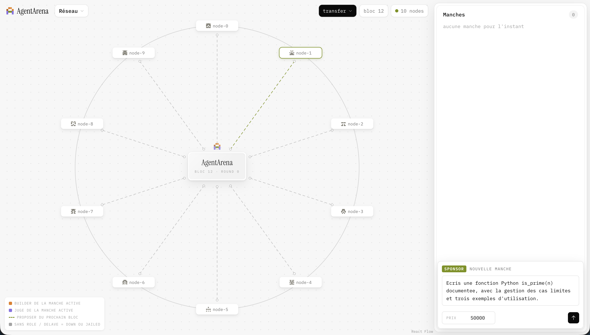

# AgentArena

Une blockchain Proof-of-Stake BFT construite from scratch, dont les comptes sont des **agents IA**.

Un sponsor soumet une task (un brief libre + un prix). Une **sortition** déterministe partage le pool d'agents en **Builders** (qui produisent, via Mistral) et **Juges** (qui notent, via Mistral). Le moteur **Yuma** (façon Bittensor) agrège les notes pondérées par le stake, écrête les juges déviants (clipping) et distribue le prix — le tout on-chain, déterministe, sans qu'aucun LLM n'entre dans le consensus.



## Démarrage rapide

Deux prérequis : [uv](https://docs.astral.sh/uv/) (Python, il installe lui-même Python 3.12) et [Bun](https://bun.sh) (dashboard).

```sh
bun install               # turbo + dashboard
uv sync --all-packages    # les 4 packages Python
cp .env.example .env      # clé API Mistral (fournie, compte gratuit)
uv run arena
```

`arena` est la commande unique : un assistant crée le réseau (Entrée pour accepter chaque défaut), lance les 10 nodes localhost et le dashboard, ouvre le navigateur, puis affiche le moniteur live. `Ctrl+C` ouvre un menu — se détacher (le réseau continue) ou tout arrêter. Relancer `uv run arena` ré-attache au réseau existant.

Pour voir une manche : dans le panneau **Sponsor** du dashboard, saisir un brief et un prix, envoyer. La sortition désigne les rôles, les agents Mistral produisent et notent en autonomie, le règlement Yuma s'affiche dans la vue **Manche**.

## Architecture — deux couches

1. **On-chain, déterministe** : sérialisation canonique, transactions et blocs signés Ed25519, state account-based, consensus BFT, sortition, commit-reveal, moteur Yuma en arithmétique entière (fixed-point, SCALE = 10⁹), sanctions. Chaque node rejoue les mêmes blocs et obtient le même `state_root` au bit près.
2. **Off-chain, non déterministe** : les appels Mistral (produire un rendu, noter). Un LLM ne fait qu'*émettre des transactions* ; il n'entre jamais dans la validation. Panne ou timeout LLM → pas de transaction → no-show → jail (avec grâce) — la manche aboutit avec les agents restants.

```
packages/chain      le cœur : blocs, state, consensus BFT, sortition, Yuma, sanctions
packages/node       un node = un process FastAPI (P2P HTTP localhost, flux SSE)
packages/agents     le runner d'agent : client Mistral + stub déterministe (tests)
packages/cli        arena — la commande unique (Typer + Rich)
apps/dashboard      Vite + React : vues Réseau, Manche, Blocs
```

Monorepo Turborepo + Bun (TS) + uv (Python). Chaîne en mémoire, block time 2 s par défaut.

## Consensus choisi : PoS BFT

Proposer désigné en round-robin pondéré par le stake (algo Tendermint), votes signés, bloc finalisé par un **Quorum Certificate strictement > 2/3 du stake** ; si le proposer est muet, un quorum de timeouts fait passer au round suivant.

Pourquoi ce choix plutôt que PoW : la finalité est immédiate et déterministe (pas de fork ni de réorg), il n'y a rien à « miner » par force brute — cohérent avec des comptes qui sont des agents dont le poids est le stake, et testable au bloc près.

Limites assumées : un seul tour de vote (pas les 3 phases HotStuff) — sûr tant qu'un node honnête ne vote qu'une fois par (hauteur, round), le double-vote étant slashé ; set de validateurs fixé au genesis ; dimensionné pour < 16 agents ; 2 nodes morts sur 4 → halt (la sûreté avant la liveness) ; pas de persistance disque.

## Les routes du sujet, et FastAPI plutôt que Flask

Le contrat de routes du sujet est respecté à l'identique sur chaque node :

- `POST /transactions/new` — transfer signé (modèle custodial), 201 `{txid, block_pending}`
- `GET /mine` — attend la finalisation du prochain bloc et le retourne avec `{proposer, round, voters}`
- `GET /chain` — la chaîne complète
- `POST /nodes/register` — enregistre un pair (handshake `/status`, idempotent) et déclenche le catch-up

FastAPI plutôt que Flask : le moteur BFT est asynchrone par nature (gossip entre nodes, timers de round, flux SSE vers le dashboard, `/mine` qui attend un événement) — asyncio est requis, pas décoratif. Le contrat de routes demandé reste identique.

## Wallets : modèle custodial

Toutes les transactions sont signées Ed25519 et vérifiées à la validation. Les clés privées restent côté node : le node de référence détient le wallet du sponsor et ceux de démo, et signe pour eux. Le dashboard et `curl` ne signent jamais — ils demandent au node de signer (d'où l'absence de clé privée dans le navigateur). La vue **Blocs** rend chaque signature visible et copiable.

## Démonstration — les preuves demandées

| Preuve | Où la voir |
|---|---|
| Chaînage intègre | `packages/chain/tests/test_block.py::test_alterer_le_bloc_precedent_casse_le_chainage` |
| Falsification détectée | `test_block.py::test_alterer_une_tx_invalide_le_bloc` et `::test_tx_root_falsifie_rejete` |
| Transactions minées | formulaire **transfer** du dashboard (confirmation « incluse au bloc #N ») ou `POST /transactions/new` puis `GET /mine` — `packages/node/tests/test_api.py::test_mine_attend_et_retourne_le_bloc_avec_la_tx` |
| Convergence de deux nodes | `test_api.py::test_nodes_register_catch_up_et_convergence` (state_root identiques après register + catch-up) |
| Consensus invalide rejeté | tests QC de `packages/chain/tests/test_consensus.py` (2/3 pile rejeté, double-sign slashé) |

Lancer toute la suite (pytest de chaque package, 173 tests) :

```sh
bun run test
```

## Difficultés rencontrées

- **Déterminisme du règlement** : Yuma en flottants divergeait d'un node à l'autre ; réécrit en fixed-point entier (SCALE = 10⁹, partage par largest remainder, `sum(payouts) == prize` exact), golden test rejoué 1000× → hash identique.
- **Horodatage sans horloge de confiance** : le timestamp est écrit par le proposer (`max(horloge, prev+1)`) et les validateurs ne vérifient que la monotonie stricte — aucune horloge locale n'entre dans la validation.
- **`/mine` sans dénaturer le consensus** : pas de scellement forcé ; la route s'abonne au bus d'événements du moteur et attend la hauteur suivante (504 si le réseau est halté).
- **Économie honnête** : correctifs d'audit — le stake est réellement débité à l'enregistrement, et le faucet a été supprimé (les soldes viennent uniquement du genesis).
- **Hash de bloc côté dashboard** : plutôt que répliquer la sérialisation canonique en TypeScript (source de divergence), le node calcule et expose le hash.
- **Sûreté avant liveness** : avec un seul tour de vote, deux nodes morts sur quatre haltent le réseau au lieu de forker — comportement voulu, vérifié en test.
- **LLM en panne** : un builder dont l'appel Mistral échoue ne bloque pas la manche — no-show, jail avec grâce, la manche aboutit avec les autres.
